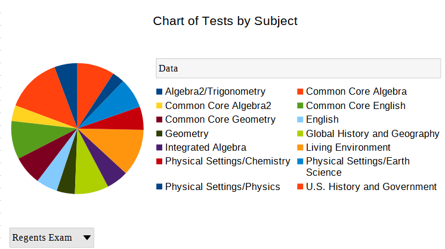

# Report on Regent Exams Data

## Origin 

[link to data](https://data.cityofnewyork.us/Education/2014-15-To-2016-17-School-Level-NYC-Regents-Report/csps-2ne9/about_data)

The file was in CSV format. 

| School DBN | School Name                     | School Type      | School Level | Regents Exam       | Year | Demographic Category | Demographic Variable | Total Tested | Mean Score | Number Scoring Below 65 | Percent Scoring Below 65 | Number Scoring 65 or Above | Percent Scoring 65 or Above | Number Scoring 80 or Above | Percent Scoring 80 or Above | Number Scoring CR | Percent Scoring CR |
|------------|--------------------------------|------------------|--------------|--------------------|------|----------------------|----------------------|--------------|------------|-------------------------|--------------------------|----------------------------|----------------------------|----------------------------|----------------------------|-------------------|--------------------|
| 01M034     | P.S. 034 Franklin D. Roosevelt | General Academic | K-8          | Common Core Algebra | 2017 | All Students         | All Students         | 4            | s          | s                       | s                        | s                          | s                          | s                          | s                          | na                | na                 |
| 01M034     | P.S. 034 Franklin D. Roosevelt | General Academic | K-8          | Living Environment | 2015 | All Students         | All Students         | 16           | 77.9       | 1                       | 6.3                      | 15                         | 93.8                       | 7                          | 43.8                       | na                | na                 |
| 01M034     | P.S. 034 Franklin D. Roosevelt | General Academic | K-8          | Living Environment | 2016 | All Students         | All Students         | 9            | 74.0       | 1                       | 11.1                     | 8                          | 88.9                       | 2                          | 22.2                       | na                | na                 |
| 01M140     | P.S. 140 Nathan Straus         | General Academic | K-8          | Common Core Algebra | 2016 | All Students         | All Students         | 3            | s          | s                       | s                        | s                          | s                          | s                          | s                          | na                | na                 |
| 01M140     | P.S. 140 Nathan Straus         | General Academic | K-8          | Common Core Algebra | 2017 | All Students         | All Students         | 2            | s          | s                       | s                        | s                          | s                          | s                          | s                          | na                | na                 |
| 01M140     | P.S. 140 Nathan Straus         | General Academic | K-8          | Living Environment | 2015 | All Students         | All Students         | 9            | 67.4       | 3                       | 33.3                     | 6                          | 66.7                       | 0                          | 0.0                        | na                | na                 |
| 01M140     | P.S. 140 Nathan Straus         | General Academic | K-8          | Living Environment | 2016 | All Students         | All Students         | 15           | 72.6       | 2                       | 13.3                     | 13                         | 86.7                       | 5                          | 33.3                       | na                | na                 |
| 01M140     | P.S. 140 Nathan Straus         | General Academic | K-8          | Living Environment | 2017 | All Students         | All Students         | 9            | 64.4       | 5                       | 55.6                     | 4                          | 44.4                       | 1                          | 11.1                       | na                | na                 |
| 01M184     | P.S. 184m Shuang Wen           | General Academic | K-8          | Common Core Algebra | 2015 | All Students         | All Students         | 49           | 78.4       | 1                       | 2.0                      | 48                         | 98.0                       | 23                         | 46.9                       | 48                | 98.0               |


# Problems in the data

The original data had quite a lot of missing data fields, so that had to be addressed. 

```
for item in row:
                if item == 's':
                    row[row.index(item)] = ''
```

I Using the code above, I checked for missing data fields and made them empty.

There were quite a lot of rows columns within my data (18 of them to be exact), and a lot of them were unnesscary to do analysis on. In hindsight, I could've probably removed even more columns without it affecting my analysis, but I think I get the important ones. 

I ran into an annoying issue when trying to delete columns outright using

```

for row in reader:
    del row[x]
```

where it would cause the indexes to shift, and then I would have to account for that when deleting multiple columns. So I decided to just calculate the index of all the columns I didn't want in advanced and simply not add them.

```
 if first_row:
                for index, category in enumerate(row):
                    if category.strip() == 'School DBN' or category.strip() == 'Number Scoring CR' or category.strip() == 'Demographic Variable' or category.strip() == 'Percent Scoring CR':
                        columns_to_delete.append(index)
            row  = [col for index, col in enumerate(row) if index not in columns_to_delete]

```
## Links to files

[data file](data/data.csv) 

[Munged Data](data/cleaned_data.csv)

[Spreadsheet](data/spreadsheet.ods)


## Analysis

1. **Mean Total Tested** - This calculates the average number of students tested at a school within one year. This can show in general how many students are testing at a facility. 

2. **Max Total Tested** - This calculates the max number of students at tested at a school within a year. This helps give prespective to the max amounts of students taking the regents in a year at a nyc school. 

3. **Median Total Tested** - This calcualtes the median of the total tested in a year for all nyc schools in this dataset. This provides perhaps a better prespective on a better average of how many students are tested in a year at an average schoo. 

4. **Min Total Tested** - This shows the minimum amount of tests taken at a school in any given year. It can be interesting to note that a school could only have administered a regent test to only a single student. 

5. **Average of mean score over 65** - This calculates the average score of those with at least passing scores. This may help eliminate certain lower bias scores dragging the average down, and show a better representation of the average score. 

6. **Min Total tested at a high school** - This shows the minimum number of tests taken if the school is considered a high school. It's interesting that there are highschools which administered 1 regent exam in a year. 

7. **Sum of all tests taken at a high school** - This shows the total amount of all tests that are taken at a high school. Helps gives prespective on how many high school students there are that have actually taken the regents from 2014-2017.

8. **Max Mean Score of Living Environment exams**
This shows the highest mean score of a school that took the living environment regent. This displays a more specific mean by narrowing down a subject, and helps you see how high the means can be.

## Visualizations



This is a breakdown of all tests taken filtered by the subject of the test. Helps to see that the subjects are fairly varied with a pretty even spread.

### Pivot Table


| School Name                                         | School Type       | Sum - Total Tested | Sum - Number Scoring 65 or Above |
|-----------------------------------------------------|-------------------|--------------------|-----------------------------------|
| The American Sign Language and English Secondary   | Special Education| 1340               | 679                               |
| A. Philip Randolph Campus High School              | General Academic | 7547               | 4748                              |
| Abraham Lincoln High School                        | General Academic | 14058              | 7122                              |
| Abraham Lincoln Yabc                               | YABC              | 667                | 256                               |
| Academy for Careers in Television and Film         | Career Technical | 3854               | 2798                              |
| Academy for College Preparation and Career Explora | General Academic | 2413               | 1153                              |
| Academy for Conservation and the Environment       | General Academic | 2338               | 1148                              |
| Academy for Environmental Leadership               | General Academic | 2366               | 988                               |
| Academy for Health Careers                         | Career Technical | 2000               | 1088                              |
| Academy for Language and Technology                | General Academic | 2662               | 1497                              |
| Academy for New Americans                          | General Academic | 1                  |                                   |

This pivot table displays the school, the type of the school, the sum of of tests taken, and the sum of passing scores (65 or above). This table helps you how many people are passing the exams that are actually taking it. 

